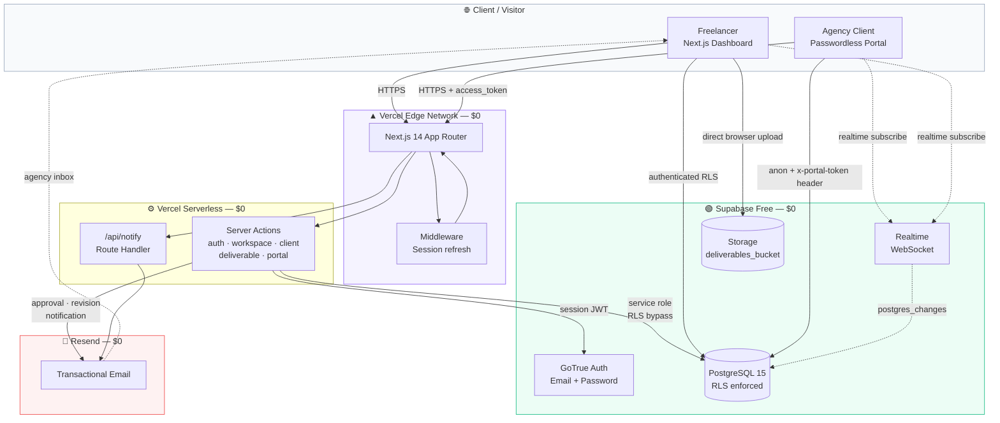
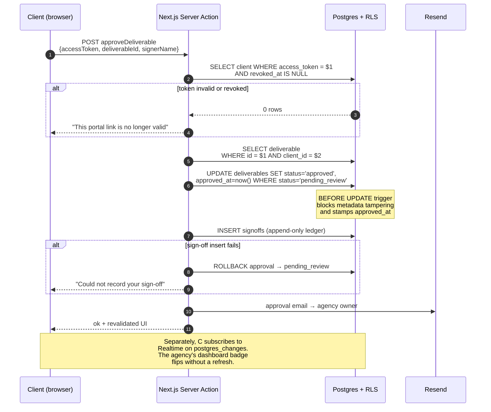
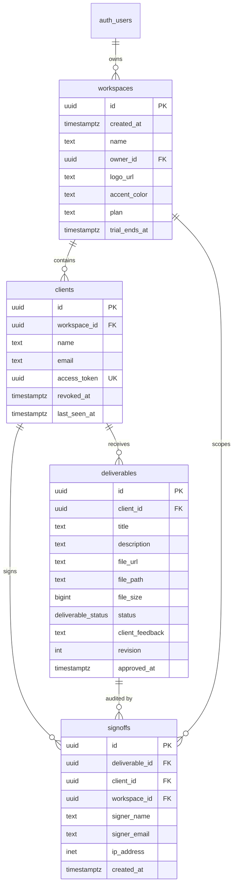
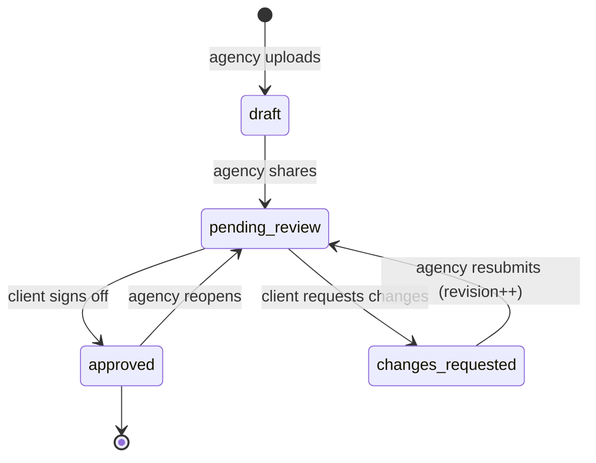
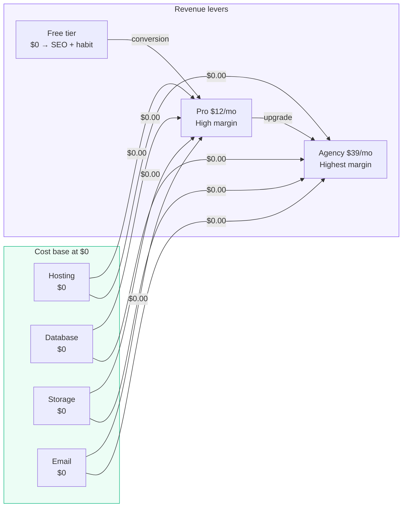

# ClientSync

> A zero-cost, passwordless client portal for freelancers and agencies.
> Upload a deliverable, copy one magic link, and let your client approve it or
> ask for changes — no client account, no password, and **$0.00/month** in
> infrastructure.

[](https://nextjs.org)
[](https://www.typescriptlang.org)
[](https://tailwindcss.com)
[](https://supabase.com)
[](https://vercel.com)
[](https://resend.com)
[](LICENSE)

**Live demo → https://clientsync-lovat.vercel.app**

To try it: create an account, add a client (this generates their magic link), upload a deliverable and mark it *Pending review* — the client link then shows the Approve / Request changes actions. The link works in any browser, no account needed on the client side.

---

## Table of Contents

1. [Executive Summary](#1-executive-summary)
2. [The Problem](#2-the-problem)
3. [Architecture](#3-architecture)
4. [Tech Stack & $0 Free-Tier Matrix](#4-tech-stack--0-free-tier-matrix)
5. [Feature Tour](#5-feature-tour)
6. [Local Setup](#6-local-setup)
7. [Environment Variables](#7-environment-variables)
8. [Database Schema](#8-database-schema)
9. [Security Model](#9-security-model)
10. [Deployment to Vercel](#10-deployment-to-vercel)
11. [Theoretical Fiscal Architecture](#11-theoretical-fiscal-architecture)
12. [Project Structure](#12-project-structure)
13. [Troubleshooting](#13-troubleshooting)
14. [Contributing](#14-contributing)
15. [License](#15-license)

---

## 1. Executive Summary

**ClientSync** is a production-grade, self-hostable client portal platform for
freelancers and small agencies. The premise is deliberately narrow: the
bottleneck in creative freelancing is not the work, it is the *approval loop* —
getting a client to look at a file and say yes.

ClientSync removes that friction with a **token-based, passwordless portal**.
The agency uploads deliverables to object storage and hands the client a single
URL. The client opens it on any device, previews the work, and completes a
digital sign-off or leaves written revision feedback. Every decision is
timestamped in an append-only audit ledger and the agency is emailed
immediately.

The system runs **entirely on free tiers** — Vercel Hobby, Supabase Free, and
Resend's 3,000 emails/month. There is no paid dependency, no credit card, and no
metering infrastructure to build. The full infrastructure bill is **$0.00 per
month**, which is the point: it proves the product is viable at a $0 CAC and
makes the freemium economics in [Section 11](#11-theoretical-fiscal-architecture)
concrete rather than speculative.

**Who it is for**

- Solo freelancers who currently email PDFs and wait three days for a "looks good"
- Small design/development studios juggling 5–20 client relationships
- Agencies that need a *provable* approval trail for scope and billing disputes

**What makes it different from the alternatives**

| Alternative | Problem it solves poorly |
| --- | --- |
| Email attachments | No status, no audit trail, no timestamp |
| Google Drive share links | File-hosting, not an approval *workflow* |
| Dropbox Sign / DocuSign | Per-signature pricing, account required, heavy for a design review |
| Custom-built portal | Weeks of work plus ongoing maintenance for one feature |

ClientSync is the smallest thing that fully solves the approval loop, and it
degrades gracefully: if Resend is down, approvals still succeed and are recorded.

---

## 2. The Problem

A freelancer's week is not spent designing. It is spent on coordination
overhead, and the single most expensive form of it is **approval ambiguity**.

Concretely, a typical project hits the same wall:

1. Work is finished. Files are zipped and emailed.
2. Three days pass with no reply. Was the email seen? Did it open?
3. The client replies: *"Looks good, but can we try the other font?"*
4. A new version goes out. There is no record of which version was approved.
5. Two weeks later, invoicing arrives and the client says they never approved
   the final file.

Every one of these is a **coordination failure**, not a technical one. The
client is not uncooperative — they simply lack a shared surface where
"approved" has an unambiguous meaning. Meanwhile:

- **Account creation is a conversion killer.** Any portal that asks a client to
  sign up loses people. The client is doing you a favour by reviewing your work.
- **Notifications are the product.** A portal nobody opens is a portal that
  generates support tickets instead of approvals.
- **Auditability is the differentiator at scale.** Small projects survive on
  goodwill. Once you are three revisions deep with a scope dispute, you need
  a signed, timestamped record.

ClientSync attacks all three: **zero accounts**, **email on every state change**,
and an **append-only sign-off ledger** that survives client disputes.

---

## 3. Architecture

### 3.1 System diagram



### 3.2 The passwordless data path

This is the part worth reading twice. A client has **no Supabase session** —
the only credential is a 128-bit `access_token` stored in the URL.



**Authorisation is enforced at three layers**, so no single bug grants access:

1. **Transport** — the token travels as a header/param, never trusted from the client-supplied body alone.
2. **Row** — the server action re-queries the client by token and pins every query to `client.id`, so a client cannot approve another client's deliverable by guessing an ID.
3. **Column** — a `BEFORE UPDATE` trigger rejects any `anon` write that touches `title`, `description`, `file_url`, `file_path`, `client_id`, or `created_at`. A leaked link can flip a status; it cannot rewrite history.

### 3.3 Component responsibilities

| Layer | File(s) | Responsibility |
| --- | --- | --- |
| Middleware | `middleware.ts` | Refresh the Supabase session, redirect unauthenticated users, keep `/portal/*` public |
| Supabase clients | `lib/supabase/{client,server,admin,}.ts` | Browser, request-bound server, and service-role clients |
| Auth actions | `app/actions/auth.ts` | Sign in/up/out, Zod validation, atomic workspace bootstrap |
| Domain actions | `app/actions/workspace.ts` | Workspaces, clients, token rotation, revocation |
| Upload actions | `app/actions/deliverable.ts` | Deliverable CRUD, direct-to-storage upload, status transitions |
| Portal actions | `app/actions/portal.ts` | Token resolution, approval + sign-off ledger, revision requests |
| Notifications | `app/api/notify/route.ts` | Auth-guarded trigger for optional client nudges |
| Email | `lib/email/{templates,send}.ts` | Inline-CSS HTML emails, fire-and-forget delivery |
| UI | `components/ui/*` | shadcn/ui primitives (Button, Card, Dialog, Table, Badge…) |

---

## 4. Tech Stack & $0 Free-Tier Matrix

### 4.1 The stack

| Layer | Choice | Why this one |
| --- | --- | --- |
| Framework | **Next.js 14.2 (App Router)** | Server Components keep the service-role key off the client; Server Actions remove a whole class of API boilerplate |
| Language | **TypeScript 5 (strict)** | The Supabase response types catch shape errors at build time |
| Styling | **Tailwind CSS 3.4** | Consistent design system, tiny CSS payload on Vercel's CDN |
| Components | **shadcn/ui + Radix** | Copy-in components, no runtime vendor lock-in, full a11y |
| Icons | **Lucide React** | Tree-shakeable, consistent stroke geometry |
| Database | **Supabase PostgreSQL** | RLS is the security backbone — row-level isolation *in the database* |
| Auth | **Supabase GoTrue** | Email+password, sessions in cookies via `@supabase/ssr` |
| File storage | **Supabase Storage** | Public-read CDN, authenticated-write policies, 1 GB free |
| Realtime | **Supabase Realtime** | Live approval badges via `postgres_changes`, no polling |
| Email | **Resend** | 3,000 emails/month free, simple API, React-quality HTML |
| Validation | **Zod** | Shared schema contract between client and server actions |
| Hosting | **Vercel Hobby** | Zero-config Next.js builds, global CDN, 100 GB bandwidth |
| Client state | **React state + Realtime** | No extra state library needed; mutations are server actions |

### 4.2 Free-tier capacity matrix

Everything below is a hard free-tier limit, not a soft target.

| Service | Free tier | ClientSync's usage at scale | Headroom |
| --- | --- | --- | --- |
| **Vercel** — bandwidth | 100 GB / month | ~1 MB per portal page view, ~2 GB at 2,000 views/mo | ~50× |
| **Vercel** — function invocations | 1M / month (Hobby) | ~3 per page view (page, RSC payload, action) | ~150× |
| **Vercel** — build minutes | 600 / month | ~2 min per deploy, a few deploys a week | ~99% unused |
| **Supabase** — database | 500 MB | ~50 KB per workspace incl. feedback text | ~10,000× |
| **Supabase** — storage | 1 GB | 50 MB cap/file; ~20 full-capacity files | ~400 MB spare |
| **Supabase** — egress | 5 GB / month | 1 GB pool + cache misses | ~5× |
| **Supabase** — MAU | 50,000 | 1 per agency owner (clients are **not** MAU — they use the anon role via `access_token`) | **unlimited clients** |
| **Supabase Realtime** | 2 concurrent GB + 200 MB | ~50 KB per open portal | effectively unlimited |
| **Resend** — emails | 3,000 / month | 1 approval + 1 revision per client action | ~1,500 approval cycles/mo |
| **Resend** — verified domains | 1 | exactly 1 needed | 100% used |
| **Total** | — | — | **$0.00 / month** |

### 4.3 What is deliberately *not* used

Choosing what to exclude is as important as what to include for a $0 stack:

- **No Stripe.** Billing is out of scope for a $0 baseline; `workspaces.plan`
  already carries a `free | pro | agency` enum ready for a future Stripe attach.
- **No background job queue** (Inngest, Trigger.dev, BullMQ). Serverless
  functions are not durable daemons, and the only background-ish work
  (analytics `last_seen_at`) is a single best-effort `UPDATE`.
- **No external CMS or ORM** (Prisma, Drizzle). Supabase's typed client *is*
  the data layer; an ORM would add a build step and a second source of truth.
- **No component library subscription.** shadcn/ui is MIT and vendored into
  `components/ui`.
- **No error-tracking SaaS.** Errors surface in the server logs Vercel gives
  you for free.

---

## 5. Feature Tour

### 5.1 Agency dashboard (`/dashboard`)

- **Workspace bootstrap.** Signup creates a workspace and a 14-day Pro trial
  atomically via the `bootstrap_workspace()` RPC, so the account is never in a
  half-configured state. If a workspace is missing, an inline modal creates one.
- **Live stats.** Active clients, items pending review, approvals, and total
  deliverables.
- **Client table.** Name, project, magic link preview, and per-row actions:
  copy link, preview the portal, rotate the token, revoke access, delete.
- **Token lifecycle controls.** *Rotate* mints a new uuid and instantly
  invalidates the old link. *Revoke* kills every outstanding link for a client
  while keeping their history — the right move when an engagement ends.
- **Row-level menu** with destructive-action confirmation.

### 5.2 Client detail (`/dashboard/clients/[id]`)

- **Direct-to-storage uploads.** The browser posts the file straight to
  Supabase Storage. No serverless function ever buffers a 50 MB payload, which
  is what keeps the app inside Vercel's function limits.
- **Draft vs. shared.** Save as draft (invisible to the client) or share
  immediately (`pending_review`).
- **Versioned revisions.** Resubmitting after a change request bumps
  `revision`, clears the stale feedback, and returns the item to review.
- **Live status badges.** Supabase Realtime `postgres_changes` subscription
  flips the badge the instant a client decides — no polling, no refresh.
- **Storage hygiene.** Replacing a file deletes the previous object so the
  1 GB pool does not leak.
- **Client feedback digest** and a **digital sign-off log** with signer name,
  timestamp, and IP.

### 5.3 Passwordless client portal (`/portal/[access_token]`)

The page a client actually sees. No login screen, ever.

- **Agency branding** — logo, name, accent colour applied to every interactive
  element, so the portal reads as the agency's product rather than a third-party
  tool.
- **Status-badged deliverable cards** with file preview/download.
- **Two actions, both one click to reach:**
  - **Approve deliverable** → opens a sign-off dialog, records the typed name
    as a digital signature with a timestamp, IP, and user agent, then emails
    the agency.
  - **Request changes** → opens a feedback modal, stores the comment in
    `client_feedback`, sets `changes_requested`, and emails the agency with the
    comment inlined.
- **Approved items lock.** Once signed off, the client cannot silently
  un-approve or edit the record — the database refuses it.
- **Real-time updates.** If the agency uploads a new version while the client is
  reading the page, it appears without a refresh.
- **Invalid/revoked links** get a clear, non-leaky "link isn't valid" page
  rather than a stack trace.

### 5.4 Notifications (`/api/notify`)

| Event | Recipient | Trigger |
| --- | --- | --- |
| `deliverable.approved` | Agency owner | Client signs off |
| `changes_requested` | Agency owner | Client submits feedback |
| `deliverable.shared` | Client | Dashboard-triggered nudge |

Approval and revision emails fire from inside the server action so the sign-off
ledger and the email share one transaction boundary. `deliverable.shared` is
exposed as an authenticated route for on-demand nudges and external webhooks.

**Delivery is never load-bearing.** If `RESEND_API_KEY` is missing or Resend is
down, `sendEmail` returns `{ sent: false, reason }`, the action still succeeds,
and the failure is logged. Notifications are a courtesy; the approval is the
product.

---

## 6. Local Setup

### 6.1 Prerequisites

| Requirement | Version | Check |
| --- | --- | --- |
| Node.js | 18.18+ (20 LTS recommended) | `node -v` |
| npm | 9+ | `npm -v` |
| Git | any recent | `git --version` |
| A Supabase project | free tier | [database.new](https://supabase.com/dashboard) |
| A Resend account | free tier | [resend.com](https://resend.com) |

### 6.2 Clone and install

```bash
git clone https://github.com/devpost-web-design/clientsync.git
cd clientsync
npm install
```

### 6.3 Create the Supabase project

1. Go to [supabase.com/dashboard](https://supabase.com/dashboard) → **New project**.
2. Name it `clientsync`, generate a strong database password, pick a region
   close to your users.
3. Wait ~2 minutes for provisioning.

### 6.4 Apply the database migration

Run these **three files, in order**. Each is idempotent.

| # | File | What it does |
|---|------|--------------|
| 1 | [`supabase/migrations/0001_init.sql`](supabase/migrations/0001_init.sql) | Tables, enums, RLS policies, storage bucket, realtime |
| 2 | [`supabase/0002_security_fix.sql`](supabase/0002_security_fix.sql) | Corrects `caller_role()` (JWT claim lookup) and stops the portal RLS policies from exposing `draft` deliverables |
| 3 | [`supabase/0003_cascade_fix.sql`](supabase/0003_cascade_fix.sql) | Makes the column guard return `OLD` on `DELETE` and only fire on real PostgREST traffic, so `ON DELETE CASCADE` works |

> Files 2 and 3 fix real, exploitable bugs and are already folded into
> `0001_init.sql` — a **fresh** project only needs file 1. Run all three when
> upgrading a database that was created before those fixes.

**Option A — Dashboard (simplest)**

1. Open **SQL Editor** → **New query**.
2. Paste the entire contents of file 1. Click **Run**.
3. Repeat for files 2 and 3.

File 1 ends with a `NOTICE` confirming 4 tables, the bucket, and the policy count; files 2 and 3 each end with a `NOTICE` too.

**Option B — Supabase CLI**

```bash
npx supabase login
npx supabase link --project-ref <your-project-ref>
npx supabase db push
psql "$DB_URL" -f supabase/0002_security_fix.sql
psql "$DB_URL" -f supabase/0003_cascade_fix.sql
```

> The migrations are **idempotent** — every `CREATE` is guarded and every
> `CREATE POLICY` starts with a `DROP POLICY IF EXISTS`, so re-running them on an
> existing project is safe. If you only need to create or repair the storage
> bucket, run [`supabase/setup-storage.sql`](supabase/setup-storage.sql) instead.

### 6.4.1 Verify the installation

```bash
npm run e2e
```

`scripts/e2e.mjs` is a 26-assertion suite that runs against your **live**
database. It provisions a throwaway auth user, then checks RLS isolation, the
magic-link lifecycle (rotate/revoke), that drafts are invisible to portal
links, that the column guard blocks metadata tampering, and that
`ON DELETE CASCADE` actually cascades. It reads your keys from `.env.local`,
prints no secrets, and leaves the database empty.

Expected: `26 passed, 0 failed`.

### 6.5 Configure Supabase Auth

1. **Authentication → Providers → Email**
2. Keep **Enable Signup** on.
3. **Confirm email**: leave **ON** for production realism; turn it **OFF** while
   developing locally to skip the inbox round-trip.
4. Copy **Site URL** → `http://localhost:3000`.
5. Add `http://localhost:3000/auth/callback` to **Redirect URLs**.

### 6.6 Grab your API keys

From **Project Settings → API Keys**:

| Key | Where it goes |
| --- | --- |
| Project URL | `NEXT_PUBLIC_SUPABASE_URL` |
| `anon` `public` | `NEXT_PUBLIC_SUPABASE_ANON_KEY` |
| `service_role` | `SUPABASE_SERVICE_ROLE_KEY` ⚠️ server-only |

> ⚠️ **`service_role` bypasses Row Level Security.** Never put it in a
> `NEXT_PUBLIC_` variable, never commit it, and rotate it immediately if it
> leaks. It is only ever read by `lib/supabase/admin.ts`, which is guarded by
> `import "server-only"`.

### 6.7 Grab your Resend key

1. Sign in at [resend.com](https://resend.com) → **API Keys** → **Create API Key**.
2. Copy it. With no domain verified you can send to your own address using
   `onboarding@resend.dev`; for real clients, add and verify a domain and set
   `RESEND_FROM_EMAIL`.

### 6.8 Create `.env.local`

```bash
cp .env.example .env.local     # macOS / Linux
copy .env.example .env.local   # Windows PowerShell
```

```dotenv
NEXT_PUBLIC_SUPABASE_URL=https://xxxxxxxxxxxx.supabase.co
NEXT_PUBLIC_SUPABASE_ANON_KEY=eyJhbGciOi...
SUPABASE_SERVICE_ROLE_KEY=eyJhbGciOi...

RESEND_API_KEY=re_xxxxxxxxxxxx
RESEND_FROM_EMAIL=ClientSync <onboarding@resend.dev>

NEXT_PUBLIC_APP_URL=http://localhost:3000
```

### 6.9 Run it

```bash
npm run dev
```

Open <http://localhost:3000>.

### 6.10 Verify the whole loop

1. **Sign up** with any email and a password ≥ 8 characters.
2. You land on `/dashboard` with a workspace already created.
3. **Add client** → name + email → you get a magic link. Click **Copy**.
4. Open the link in a **private window** (proving no login is needed).
5. Back on `/dashboard/clients/[id]`, upload a file → **Share with \<name\>**.
6. In the private window, the card appears **instantly** via Realtime.
7. Hit **Approve deliverable** → type a name → sign off.
8. Check the agency dashboard: badge flips to **Approved** and the sign-off log
   gains a row. Check your inbox: the approval email arrived.

### 6.11 Useful scripts

| Command | What it does |
| --- | --- |
| `npm run dev` | Dev server with hot reload |
| `npm run build` | Production build (runs lint + typecheck) |
| `npm run start` | Serve the production build |
| `npm run lint` | ESLint via `next lint` |
| `npm run typecheck` | `tsc --noEmit` |

---

## 7. Environment Variables

| Variable | Required | Scope | Purpose |
| --- | --- | --- | --- |
| `NEXT_PUBLIC_SUPABASE_URL` | ✅ | Client + server | Supabase project origin |
| `NEXT_PUBLIC_SUPABASE_ANON_KEY` | ✅ | Client + server | RLS-scoped `anon` key |
| `SUPABASE_SERVICE_ROLE_KEY` | ✅ | **Server only** | Service role for portal reads, sign-offs, Storage cleanup |
| `RESEND_API_KEY` | ⬜ | Server | Transactional email. Absent → emails skipped, app still works |
| `RESEND_FROM_EMAIL` | ⬜ | Server | Verified sender. Defaults to `onboarding@resend.dev` |
| `NEXT_PUBLIC_APP_URL` | ➖ | Client + server | Magic-link origin. Auto-detected on Vercel |
| `NEXT_PUBLIC_APP_NAME` | ➖ | Client + server | Display name. Defaults to `ClientSync` |
| `CRON_SECRET` | ⬜ | Server | Alternative auth for `POST /api/notify` from webhooks |

`lib/env.ts` deliberately **does not throw at build time** when variables are
missing — `vercel build` must succeed before secrets are wired. Instead it
returns empty strings from getters and reports the gap at request time, so a
misconfiguration surfaces as a clear runtime error rather than a failed build.

---

## 8. Database Schema



### 8.1 The status enum

```sql
create type public.deliverable_status as enum (
  'draft',             -- agency-only; never exposed to a client
  'pending_review',    -- shared, awaiting a client decision
  'changes_requested', -- client asked for revisions
  'approved'           -- signed off; terminal until the agency reopens it
);
```

### 8.2 State machine



`approved_at` is set automatically on the transition into `approved` and cleared
on any exit, so a badge can never claim an approval that has been rolled back.

### 8.3 Storage layout

Bucket: **`deliverables_bucket`** — public read, authenticated write, 50 MB/file
cap, MIME allow-list.

```
deliverables_bucket/
└── <workspace_id>/<client_id>/<deliverable_id>-<timestamp>-<sanitised_name>.pdf
```

The first path segment is the workspace id, which is exactly what the storage
write policy checks (`public.is_workspace_owner(...)`). A signed-in user cannot
write outside their own workspace, and the public bucket means client downloads
are a straight CDN hit with no auth round-trip.

---

## 9. Security Model

### 9.1 Principles

1. **The database is the security boundary.** Every policy is enforced by
   Postgres, not by a UI check. Tamper with the client and you change a React
   tree, not a permission.
2. **Least privilege, expressed in SQL.** Four `security definer` helper
   functions (`is_workspace_owner`, `is_client_owner`, `is_valid_portal_token`,
   `storage_object_workspace`) exist purely so policies can answer "is this
   mine?" without recursively re-entering their own RLS. Each pins
   `search_path` to prevent function hijacking.
3. **FORCE ROW LEVEL SECURITY** is enabled on all four tables, so even the table
   owner is subject to the policies when connecting through PostgREST.

### 9.2 Policy matrix

| Table | `authenticated` (agency) | `anon` (portal) | `service_role` |
| --- | --- | --- | --- |
| `workspaces` | Full CRUD where `owner_id = auth.uid()` | ❌ none | ✅ bypass |
| `clients` | Full CRUD where workspace is owned | ✅ SELECT own token only | ✅ bypass |
| `deliverables` | Full CRUD where client is owned | ✅ SELECT + UPDATE own token only, columns restricted by trigger | ✅ bypass |
| `signoffs` | SELECT where workspace is owned | ✅ SELECT own token only | ✅ INSERT (server action) |
| `storage.objects` | INSERT/UPDATE/DELETE where path workspace is owned | ✅ SELECT (bucket is public) | ✅ bypass |

`anon` has **no INSERT or DELETE anywhere** and `signoffs` is explicitly
`revoke`d from both `anon` and `authenticated` for writes — the audit ledger is
append-only via the service role only.

### 9.3 Token handling

- **122 bits of entropy** (uuid v4). Not enumerable, not sequential.
- **Revocable** — `revoked_at` kills every outstanding link at once; the portal
  read query filters on it, so a revoked link 404s immediately.
- **Rotatable** — one click mints a new token and invalidates the old.
- **Never leaked into metadata.** `generateMetadata` for the portal route
  ignores `params` entirely so the token cannot land in a `<title>` tag, a
  sitemap, or a `Referer`-adjacent cache key.
- **RLS-scoped via header.** The portal browser client sends the token as
  `x-portal-token`; `public.portal_token()` reads it from
  `request.headers` with a uuid regex guard, so a malformed header returns
  `NULL` rather than raising or matching.

### 9.4 Portal write surface (column guard)

Postgres RLS is row-level, not column-level, so an extra `BEFORE UPDATE`
trigger narrows what an `anon` caller may change:

```sql
-- allowed:   status, client_feedback, feedback_at, approved_at, revision
-- rejected:  title, description, file_url, file_path, file_name,
--            file_size, file_type, client_id, created_at, due_date
```

It also enforces the state machine (only `pending_review → approved` is legal) and keeps `approved_at` consistent. A leaked portal link can therefore *act* on a deliverable but cannot *rewrite* one.

### 9.5 Application-level hardening

| Concern | Mitigation |
| --- | --- |
| Open redirect on the auth callback | `sanitizeNext()` rejects anything not starting with a single `/` |
| CSRF on logout | `POST` route, not a link, so prefetching cannot sign anyone out |
| Path traversal in filenames | `sanitizeFileName()` strips separators and unsafe characters |
| Oversized / wrong-type uploads | Client-side MIME allow-list + 50 MB cap **and** the same constraints in the bucket policy |
| XSS in emails | `escapeHtml()` on every interpolated value; inline-CSS HTML body |
| Portal caching | `Cache-Control: no-store` + `X-Robots-Tag: noindex` on portal/dashboard/api |
| Clickjacking | `X-Frame-Options: DENY` on all routes |
| Reference to next-postcss advisories | Pinned to the patched `next@14.2.35`; see [Troubleshooting](#13-troubleshooting) |

### 9.6 Known trade-offs (stated honestly)

- **Tokens in URLs land in browser history and can leak via `Referer`.** Mitigated
  with `Referrer-Policy: strict-origin-when-cross-origin` and `no-store`, but a
  fully leak-proof design would use a post-login exchange for a session cookie.
  For a 2-click approval flow on a free tier, the friction is not worth it.
- **The storage bucket is public-read.** A guessable object path would be
  guessable, so paths embed three uuids plus a timestamp and the sanitised
  filename. For confidential work, switch the bucket to private and mint
  signed URLs.
- **RLS is bypassed by the service role** inside the portal server actions, so
  every one of those actions re-validates the token and pins queries to
  `client.id` explicitly. That re-validation is the real control, not RLS.

---

## 10. Deployment to Vercel

Deploying ClientSync costs **$0.00** and takes about eight minutes.

### 10.1 Push to GitHub

```bash
git add .
git commit -m "feat: ClientSync v1.0.0 — passwordless client portal"
git branch -M main
git remote add origin https://github.com/devpost-web-design/clientsync.git
git push -u origin main
```

### 10.2 Import the project

1. Go to [vercel.com/new](https://vercel.com/new).
2. Import the `clientsync` repository. Vercel detects Next.js automatically —
   accept the detected framework preset.
3. Click **Deploy**. The first build may fail; that is expected and harmless,
   because the Supabase env vars are not set yet. Continue to step 10.3.

### 10.3 Add environment variables

**Project → Settings → Environment Variables → Add all:**

| Name | Value | Environments |
| --- | --- | --- |
| `NEXT_PUBLIC_SUPABASE_URL` | `https://<ref>.supabase.co` | Production, Preview, Development |
| `NEXT_PUBLIC_SUPABASE_ANON_KEY` | your anon key | Production, Preview, Development |
| `SUPABASE_SERVICE_ROLE_KEY` | your service-role key | **Production, Preview** |
| `RESEND_API_KEY` | `re_…` | Production, Preview |
| `RESEND_FROM_EMAIL` | `ClientSync <notifications@yourdomain.com>` | Production |
| `CRON_SECRET` | `openssl rand -hex 32` | Production |

> For **Local Development**, point every variable at your local `.env.local`
> values so `vercel dev` behaves identically.

### 10.4 Update the Supabase auth URLs

**Authentication → URL Configuration:**

| Setting | Value |
| --- | --- |
| Site URL | `https://your-app.vercel.app` |
| Redirect URLs | `https://your-app.vercel.app/auth/callback` |

To generate the auth link on the real domain, set `NEXT_PUBLIC_APP_URL` and
redeploy — `lib/env.ts` also auto-detects `VERCEL_PROJECT_PRODUCTION_URL`, so
this is often unnecessary.

### 10.5 Redeploy and verify

```bash
npx vercel --prod        # or: Project → Deployments → ⋯ → Redeploy
```

Then walk the [§6.10 verification](#610-verify-the-whole-loop) checklist
against the production URL.

### 10.6 Custom domain (optional, still free)

**Project → Settings → Domains** → add your domain → point the `A` record at
`cname.vercel-dns.com`. Then set `NEXT_PUBLIC_APP_URL=https://yourdomain.com`
and redeploy.

### 10.7 Free-tier guardrails

Vercel Hobby limits that will not bite at this scale, but know them:

- **100 GB bandwidth / month** — a 50 MB download is 0.05% of the budget.
- **12 serverless function deployments / day** (Hobby) — deploy a few times a
  week at most.
- **No `fluid`/cron guarantees** — the app has no background jobs to lose.

---

## 11. Theoretical Fiscal Architecture

This section explains why a **$0 operational baseline** is a business asset
rather than a compromise. It is deliberately modelled as a theory with stated
assumptions, not a financial projection.

### 11.1 The unit economics of $0

ClientSync's cost structure has three properties that most SaaS products lack:

1. **No marginal infrastructure cost per client.** Adding a client costs one
   Postgres row and one uuid. It does not cost a server.
2. **No payment-processing cost to start.** No Stripe fees, no metered billing
   infrastructure, no dunning.
3. **No support cost to start.** No client login means no "I can't log in"
   tickets. The single largest support sink for portal products simply does not
   exist.

That third point is the one founders underestimate. In portal-shaped products,
*authentication friction is usually the top support category*. Removing login
removes the category, not just the feature.



### 11.2 The free tier as a distribution channel

The free tier is not charity; it is the top of a funnel whose only fuel is
**product usage**:

- **Free-tier limit is 5 active clients.** That is deliberately calibrated to
  "one freelanceer's real book of business." The user hits the ceiling at
  exactly the moment the product has become indispensable — and the ceiling is
  what makes a paid tier legible.
- **The agency that upgrades is not being sold a feature.** It is being sold
  *the removal of a ceiling it already hit*. The `workspaces.plan` column
  (`free | pro | agency`) is already in the schema, waiting for a Stripe attach.
- **Every approval email is a branded touchpoint.** The client's inbox becomes
  a distribution surface for the agency. That is worth real money to an agency
  and is why they, not the freelancer, should be the eventual buyer.

### 11.3 Why a $0 baseline creates high margin

Assume the (deliberately conservative) price points below. Every one of them is
**infrastructure cost of $0.00** at the free-tier limits in [§4.2](#42-free-tier-capacity-matrix),
so gross margin on paid revenue is 100% until the first limit is hit.

| Tier | Price | Purpose | Gross margin at free-tier limits |
| --- | --- | --- | --- |
| **Free** | $0 | Solo freelancer, ≤5 clients | — (acquisition) |
| **Pro** | $12 / mo | Unlimited clients, custom branding, email from your own domain | **100%** |
| **Agency** | $39 / mo | Multiple workspaces, SSO-ready audit export, priority support | **~100%** |

Where the $0 baseline stops being $0, and what each upgrade would cost:

| Limit reached | Free tier | First paid fix | Typical cost |
| --- | --- | --- | --- |
| Supabase storage 1 GB | ~20 max-size files | Storage Pro, 100 GB | $20 / mo |
| Resend 3,000 emails | ~1,500 approval cycles | Resend Pro, 50k emails | $20 / mo |
| Vercel bandwidth 100 GB | ~100k portal views | Vercel Pro, 1 TB | $20 / mo |
| Supabase MAU 50,000 | effectively never | Pro, 100k MAU | $25 / mo |

The key structural insight: **all four limits are crossed at roughly the same
scale**, and the cheapest way to clear all four at once is for the *user* to
upgrade a single plan tier. A $0 baseline therefore converts into a
single-decision upgrade event, not a series of unpleasant infrastructure
decisions. That is what keeps gross margin high and support load low: the user
pays *us* instead of absorbing a 200% infrastructure bill surprise.

### 11.4 The compounding advantage

A $0 baseline has an effect that is easy to miss: **it makes the product
indistinguishable from the paid product at the moment of evaluation.**

- A freelancer trying ClientSync is not signing up for a trial that will expire;
  they are signing up for something that will still work in six months.
- No credit card means no procurement conversation, no security questionnaire,
  no "is this vendor going to disappear?" risk assessment.
- A live production URL beats a demo. A freelancer can send a *real* magic link
  to a *real* client within five minutes of signing up.

That last point is the growth engine: **the product's own output is the
marketing surface.** Every magic link an agency shares is a branded demo of
ClientSync, sent by a third party, to a sceptical audience. The CAC of that
channel is negative in the best sense — the agency pays for the privilege of
demonstrating the tool.

### 11.5 The honest failure modes

A theory that lists no failure modes is marketing. These are the real ones:

| Risk | Trigger | Mitigation in the current design |
| --- | --- | --- |
| **Free-tier ceiling outgrows pricing** | A power user gets $60/mo of infra for $12 of revenue | Hard caps in the action layer (5 clients) plus a visible upgrade path; the `plan` column already exists |
| **Storage costs scale with *value*, not usage** | 50 MB videos per deliverable blow past 1 GB fast | 50 MB/file cap + MIME allow-list + old-version cleanup on replace |
| **Resend daily cap (100/day)** | A viral post floods approvals | Approvals never fail because email is fire-and-forget; the action succeeds regardless |
| **Token-in-URL leakage** | A client pastes the link into a public channel | `no-store`, `noindex`, `Referrer-Policy`; rotate/revoke is one click |
| **Vercel Hobby is non-commercial for some orgs** | A client of the *agency* is a for-profit | The *agency* runs it for their own client work, which is standard self-use; flag it if you resell ClientSync itself as a hosted service |
| **Supabase pausing idle projects** | A free project with no traffic for 7 days | Pause is reversible and email-triggered; send a monthly "keep warm" digest to avoid it |

### 11.6 Summary

> A $0 baseline is not the *absence* of a business model — it is a business
> model where the acquisition surface and the infrastructure bill are decoupled.
> The free tier is the marketing channel, the product's own output is the
> social proof, and every paid tier sells the *removal of a ceiling the user
> has already hit* rather than the introduction of a new feature. Because the
> marginal cost of the next client is one Postgres row, gross margin stays at
> 100% right up until the user chooses to pay.

---

## 12. Project Structure

```
clientsync/
├── app/
│   ├── actions/                  # Server Actions (the entire write surface)
│   │   ├── auth.ts               # signIn / signUp / signOut
│   │   ├── workspace.ts          # workspaces, clients, tokens, revocation
│   │   ├── deliverable.ts        # deliverable CRUD + storage upload
│   │   └── portal.ts             # token auth, approval, revision requests
│   ├── api/notify/route.ts       # Auth-guarded notification endpoint
│   ├── auth/
│   │   ├── callback/route.ts     # OAuth / email-confirm code exchange
│   │   └── logout/route.ts       # POST-only sign out
│   ├── dashboard/
│   │   ├── layout.tsx            # Auth shell + sidebar
│   │   ├── page.tsx              # Stats, client table, workspace modal
│   │   ├── clients/
│   │   │   ├── new/page.tsx      # Add client
│   │   │   └── [id]/page.tsx     # Uploads, status, feedback, sign-off log
│   │   └── settings/page.tsx     # Portal branding + account
│   ├── portal/[access_token]/    # ⭐ The passwordless client portal
│   ├── login/page.tsx
│   ├── signup/page.tsx
│   ├── page.tsx                  # Public landing page
│   ├── globals.css               # Tailwind + shadcn CSS variables
│   ├── layout.tsx                # Root layout, metadata, toaster
│   ├── robots.ts  sitemap.ts  manifest.ts  icon.svg
│   └── api/
├── components/
│   ├── ui/                       # shadcn/ui primitives (vendored)
│   ├── auth/auth-form.tsx
│   ├── dashboard/                # client-table, deliverable-manager, forms
│   ├── portal/portal-deliverables.tsx   # ⭐ Approve + request-changes UI
│   ├── brand.tsx  status-badge.tsx
│   ├── copy-button.tsx  submit-button.tsx  toaster-provider.tsx
├── lib/
│   ├── supabase/
│   │   ├── client.ts             # Browser + portal (x-portal-token) clients
│   │   ├── server.ts             # Cookie-bound server client
│   │   ├── admin.ts              # service role, "server-only" guarded
│   │   └── middleware.ts → ../../middleware.ts
│   ├── email/
│   │   ├── templates.ts          # Inline-CSS HTML emails
│   │   └── send.ts               # Fire-and-forget Resend wrapper
│   ├── action-state.ts           # Shared ActionState contract
│   ├── env.ts  status.ts  types.ts  utils.ts
├── supabase/
│   ├── migrations/0001_init.sql  # ⭐ Full schema, RLS, storage, realtime
│   ├── 0002_security_fix.sql     # JWT-claim role lookup + hide drafts
│   ├── 0003_cascade_fix.sql      # Column guard: OLD on DELETE, PostgREST only
│   └── setup-storage.sql         # Idempotent bucket bootstrap
├── scripts/e2e.mjs                # 26-assertion live suite (npm run e2e)
├── middleware.ts                 # Session refresh + route protection
├── .env.example                  # Template — copy to .env.local
├── next.config.mjs               # Security headers, image config
├── tailwind.config.ts  tsconfig.json
└── README.md
```

---

## 13. Troubleshooting

<details>
<summary><strong>Build fails: "Module not found: Can't resolve 'server-only'"</strong></summary>

`server-only` is a guard package, not a shim. Install it:

```bash
npm install server-only
```
</details>

<details>
<summary><strong>Signup says "Database error saving new user"</strong></summary>

The `signups` trigger or an existing partial account is in the way. In
**Supabase → Authentication → Users**, delete the half-created user, then retry.
</details>

<details>
<summary><strong>Portal shows "This portal link isn't valid" for a brand-new client</strong></summary>

Usually the token in the URL was copied with a trailing character, or the client
was created before the migration ran. Check the exact token in the dashboard
row, or just hit **Rotate magic link**.
</details>

<details>
<summary><strong>Uploads fail with "row-level security" or "new row violates policy"</strong></summary>

The object key must start with the workspace uuid —
`<workspace_id>/<client_id>/<file>`. Confirm the migration's
`storage_object_workspace()` helper exists, and that the signed-in user really
owns the workspace.
</details>

<details>
<summary><strong>Portal returns 404 after a deploy</strong></summary>

Supabase Auth only allows registered redirect URLs. Add
`https://<your-vercel-domain>/auth/callback` under
**Authentication → URL Configuration → Redirect URLs**.
</details>

<details>
<summary><strong>Emails are not arriving</strong></summary>

1. Is `RESEND_API_KEY` set in the deployment environment, not just locally?
2. Are you on the free sandbox? `onboarding@resend.dev` only sends **to your own
   account email**.
3. Check the Vercel function logs — `sendEmail` returns `{ sent: false, reason }`
   and never throws, so the reason is in the log rather than the UI.
4. For real recipients, verify a domain and set `RESEND_FROM_EMAIL`.
</details>

<details>
<summary><strong>Realtime badges do not update live</strong></summary>

1. Confirm the migration added `deliverables` to the `supabase_realtime`
   publication.
2. Check that `replica identity full` is set on `deliverables`.
3. Open the browser console — `supabase.channel(...).subscribe()` status should
   be `SUBSCRIBED`.
4. Statuses still work on manual refresh; realtime is an enhancement, never a
   dependency.
</details>

<details>
<summary><strong>npm audit reports advisories in `next`</strong></summary>

This project is pinned to Next.js **14.2.35**, the patched 14.x release. Any
remaining advisory is in a transitive **build-time** `postcss` inside Next —
not a server-runtime vulnerability and not reachable from a request. `npm audit
fix --force` would jump to Next 16 and break the 14.x App Router contract this
project targets, so it is deliberately not applied. Upgrading to 15/16 is a
separate, planned migration.
</details>

<details>
<summary><strong>Sign-up email never arrives locally</strong></summary>

Supabase's free tier heavily rate-limits SMTP (a few emails/hour). For local
work, turn **Confirm email OFF** in **Authentication → Providers → Email**, or
just use a different address. This is a Supabase free-tier limit, not a bug.
</details>

---

## 14. Contributing

Contributions are welcome.

1. **Fork** the repository and create a branch: `git checkout -b feat/my-feature`.
2. **Install:** `npm install`.
3. **Configure:** `cp .env.example .env.local` and fill it in.
4. **Keep the build green** — this is the contract:
   ```bash
   npm run lint
   npm run typecheck
   npm run build
   ```
5. **Respect the $0 constraint.** No new service may require a paid plan,
   credit card, or a minimum spend. If a feature needs infrastructure you
   cannot get for free, it does not belong in the free path — put it behind a
   `plan` check and document it in [§4.2](#42-free-tier-capacity-matrix).
6. **Security-sensitive changes** need the SQL migration updated in the same PR,
   including the RLS policy and a note in [§9](#9-security-model).
7. **Open the PR** with a clear description and screenshots for UI changes.

**Commit convention:** Conventional Commits (`feat:`, `fix:`, `docs:`,
`refactor:`, `chore:`).

---

## 15. License

MIT — see [LICENSE](LICENSE).

You are free to use, modify, and self-host ClientSync commercially, including
offering it to your own clients. The only hard requirement is the
[§4.2 free-tier matrix](#42-free-tier-capacity-matrix) staying honest: if you
add infrastructure, document what it costs.

---

<div align="center">

**Built with Next.js 14, Supabase, Tailwind CSS, shadcn/ui and Resend.**

*$0.00/month. No credit card. No client accounts. Two-click approvals.*

[Report an issue](https://github.com/devpost-web-design/clientsync/issues) ·
[Source](https://github.com/devpost-web-design/clientsync)

</div>
